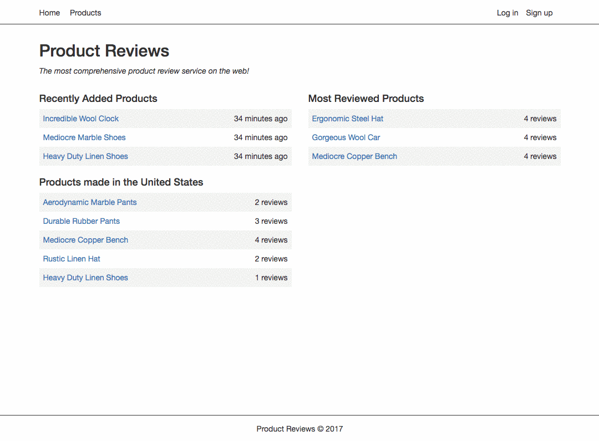

# Product Reviews

_Product Reviews_ is a Ruby on Rails application that demonstrates the core functionality for a product review site.

| Users | Privileges |
| ------ |------|
| Anonymous | View products and reviews |
| Signed Up, Logged In | View products and reviews. Add a product, add a review. Visit their user page to see all their reviews. Edit and delete a review they've created |
| Admin | Add a product, add a review. Visit their user page to see all their reviews. Edit, or delete any product or review |

#### User Views
| Signing up, adding a product and a review | Logging in, editing and deleting reviews |
| ------ |------|
|  |  |

### Dependencies
* Ruby 2.2 or greater
* Rails
* postgresql
* bundler

### Installation
* Run postgresql  
`$ postgres`
* Using a new terminal tab, clone this repo  
`$ git clone https://github.com/seanpierce/product_reviews_rails`
* Navigate into the cloned repo  
`$ cd product_reviews_rails/`
* Install dependent ruby gems  
`$ bundle install`
* Set up database  
`$ bundle exec rails db:setup`
* Start the rails server  
`$ rails s`
* visit the site at <a href="localhost:3000">localhost:3000</a>

### Usage
The database will be populated with information via the <a href="https://github.com/stympy/faker">Faker gem</a>. You can login as one of the test users, or sign up using your own credentials.
* "test@email.com", "1234567" < admin
* "test2@email.com", "1234567"
* "test3@email.com", "1234567"

-----

#### Bugs
Currently no known bugs. Please <a href="https://github.com/seanpierce/product_reviews_rails/issues/new">create an issue</a> if one is discovered.
#### Author
Sean Pierce
#### Contact
sumler.sean@gmail.com
#### License
MIT &copy; 2017
